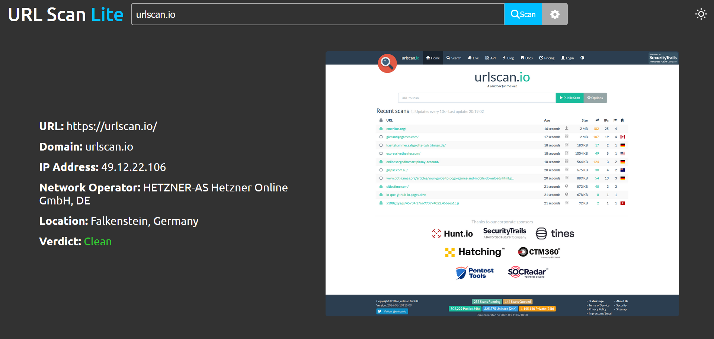

# URL Scan Lite

This project is a lite, minimalist version of [urlscan.io](https://urlscan.io/), an online service and tool that scans and analyzes websites for suspicious and malicious URLs.

The web app is a client for urlscan.io's API featuring a custom frontend built with React and Typescript. The UI has been redesigned for a cleaner, more modern look, making scan results simpler and more intuitive to view by displaying only the most relevant information for the everyday user.

## Accessing and using the app
- https://urlscanlite.vercel.app/

Enter and submit a URL to be scanned, and the scan results will return information about the website, such as its domain and IP address, as well as a screenshot of the webpage.

Scans can be submitted as public, unlisted, or private using the options menu. Please be aware that public scans will be visible to other users on urlscan.io.

